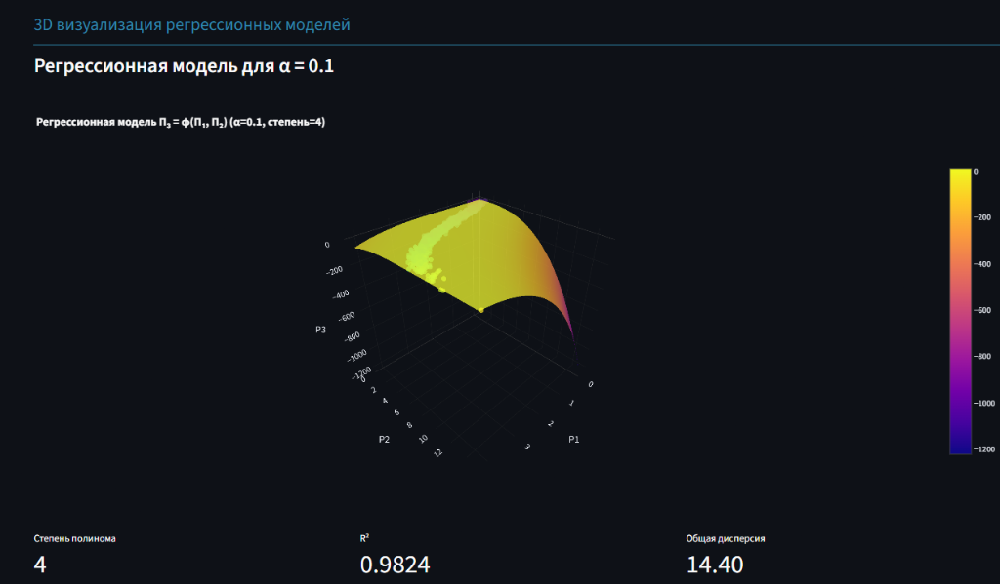

### Что изображено на рисунке и что вычисляется в коде

---

На изображении показана **3D визуализация регрессионной модели** для уровня погрешности α = 0.1. Модель описывает зависимость параметра надежности \( P_3 \) от параметров \( P_1 \) и \( P_2 \) в виде полинома 4-й степени:

\[
P_3 = \varphi(P_1, P_2), \quad \text{степень полинома} = 4, \quad \alpha = 0.1
\]

---

### Что происходит в коде:

1. **Генерация данных:**
   - Для выбранного α (здесь 0.1) генерируются 1000 случайных измерений параметров \( P_1, P_2, P_3 \) с учетом шума.
   - \( P_1 \) — равномерное распределение [0,4] + шум,
   - \( P_2 \) — распределение Эрланга (форма=4, масштаб=1) + шум,
   - \( P_3 \) — нормальное распределение N(0,3) + шум.

2. **Построение регрессионной модели:**
   - Используется полиномиальная регрессия с максимальной степенью 4.
   - Подбор степени полинома происходит автоматически через критерий Фишера, который сравнивает модели разной сложности и выбирает оптимальную.
   - Для α=0.1 оптимальная степень — 4.

3. **Визуализация:**
   - Исходные точки (\( P_1, P_2, P_3 \)) отображаются в 3D пространстве.
   - Поверх регрессии отображается поверхность, построенная по предсказаниям модели на сетке значений \( P_1 \) и \( P_2 \).
   - Цвет поверхности отражает значения \( P_3 \), что помогает визуально оценить модель.

4. **Метрики модели:**
   - **Степень полинома:** 4 (выбрана автоматически).
   - **Коэффициент детерминации \( R^2 \):** 0.9824 — очень высокая точность модели, объясняющая ~98.24% вариации данных.
   - **Общая дисперсия:** 14.40 — сумма дисперсий по всем трем параметрам, характеризует разброс данных.

---

### Что можно увидеть и понять по модели и графику:

- Модель хорошо аппроксимирует зависимость \( P_3 \) от \( P_1 \) и \( P_2 \) при низком уровне шума (α=0.1).
- Поверхность регрессии гладкая, отражает сложную полиномиальную зависимость 4-й степени.
- Высокий \( R^2 \) говорит о том, что модель объясняет почти всю вариацию в данных, шум минимален.
- Цветовая шкала справа показывает диапазон значений \( P_3 \), что помогает визуально оценить распределение и предсказания модели.
- При увеличении α (больше шума) качество модели (R²) будет снижаться, и степень полинома может уменьшаться, чтобы избежать переобучения.

---

### Итог:

- Данный график — наглядная 3D иллюстрация результата регрессионного анализа.
- Модель позволяет прогнозировать \( P_3 \) по двум другим параметрам с высокой точностью при малой погрешности.
- Этот инструмент полезен для анализа надежности и понимания взаимосвязей между параметрами в условиях различных уровней измерительных ошибок.