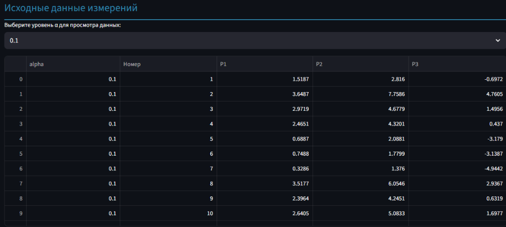

Данная таблица представляет собой фрагмент исходных данных измерений трех параметров надежности (P1, P2, P3) при уровне погрешности α = 0.1.

### Объяснение столбцов таблицы:

- **alpha** — уровень погрешности α (в данном случае 0.1). Этот параметр масштабирует шум, добавляемый к параметрам.
- **Номер** — порядковый номер измерения (от 1 до 10 в данном фрагменте).
- **P1** — значение первого параметра надежности, сгенерированного из равномерного распределения [0,4] с добавленным шумом.
- **P2** — значение второго параметра надежности, сгенерированного из распределения Эрланга (форма=4, масштаб=1) с добавленным шумом.
- **P3** — значение третьего параметра надежности, сгенерированного из нормального распределения N(0,3) с добавленным шумом.

### Что показывают данные:

- Каждая строка — это одно измерение, где указаны значения трех параметров при уровне погрешности 0.1.
- Например, первое измерение: P1 = 1.5187, P2 = 2.816, P3 = -0.6972.
- Значения отражают реальные сгенерированные данные с учетом небольшого шума (α=0.1).

### Контекст использования:

- Эти данные используются для анализа надежности, построения регрессионных моделей и визуализации.
- При увеличении α значения параметров будут иметь больший разброс из-за увеличения шума.

---
## Конкретно по трем таблицам

Таблица, представленная на рисунке, — это фрагмент исходных сгенерированных данных измерений параметров надежности P1, P2 и P3 для двух уровней погрешности α (0.1 и 0.5). 

---

### Объяснение столбцов таблицы:

- **alpha** — уровень погрешности α, который масштабирует шум, добавляемый к исходным данным параметров. Чем выше α, тем больше шум.
- **Номер** — порядковый номер измерения (от 1 до количества измерений, например, 1000).
- **P1, P2, P3** — значения трёх параметров надежности, сгенерированных согласно распределениям:
  - P1 — равномерное распределение [0,4] с шумом,
  - P2 — распределение Эрланга (форма=4, масштаб=1) с шумом,
  - P3 — нормальное распределение N(0,3) с шумом.

---

### Что показывают эти данные:

- Каждая строка — это одно измерение, содержащее значения трех параметров при заданном уровне погрешности α.
- Например, для α=0.1, первое измерение имеет значения P1=1.5187, P2=2.816, P3=-0.6972.
- Для α=0.5, первое измерение имеет другие значения, так как шум больше.

---

### Как это связано с программой:

- В коде функция `generate_reliability_data(alpha, num_samples)` генерирует эти данные.
- Значения P1, P2, P3 рассчитываются через обратное преобразование распределений и добавление нормального шума с масштабом, зависящим от α.
- В таблице представлены реальные сгенерированные выборки для каждого α.
- Эти данные используются для построения регрессионной модели, анализа и визуализации.

---

### Итог:

Таблица — это подробные исходные данные эксперимента для разных уровней погрешности. Они показывают, как варьируются параметры P1, P2, P3 при разных α, и служат основой для анализа надежности и построения моделей в приложении.