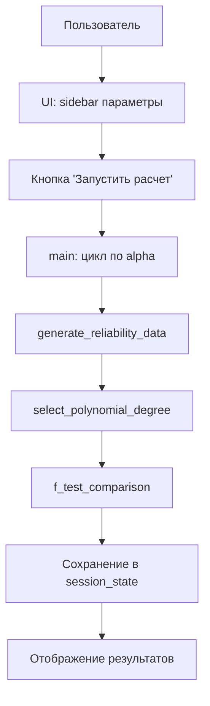

# Анализ программы: система, модули, функции, формулы и зависимости

## Архитектура программы как системы

### Общая (краткая) структура системы
```
Система анализа надежности
├── Подсистема генерации данных
├── Подсистема регрессионного анализа
├── Подсистема визуализации
└── Подсистема пользовательского интерфейса
```

## Подсистемы и модули

### 1. Подсистема генерации данных
**Модуль:** `generate_reliability_data()`

**Зависимости:**
- `numpy` - численные вычисления
- `scipy.stats` - статистические распределения

**Входные параметры:**
- `alpha` - уровень погрешности измерений
- `num_samples` - количество измерений
- `random_state` - seed для воспроизводимости

**Выходные данные:**
- `P1, P2, P3` - сгенерированные параметры надежности

### 2. Подсистема регрессионного анализа
**Модули:**
- `select_polynomial_degree()` - подбор порядка полинома
- `f_test_comparison()` - критерий Фишера

**Зависимости:**
- `sklearn` - машинное обучение
- `scipy.stats.f` - F-распределение

### 3. Подсистема визуализации
**Модули:**
- `create_scatter_plotly()` - 2D графики рассеяния
- `create_3d_regression_plot()` - 3D поверхности
- `compute_mean_curve()` - средние кривые
- `add_mean_curves_to_scatter()` - добавление кривых на графики

## Формулы и алгоритмы

### 1. Генерация параметров надежности

**Исходные формулы из задачи:**
```
П₁* = F₁⁻¹(ξ) + ε₁
П₂* = F₂⁻¹(ξ) + ε₂  
П₃* = F₃⁻¹(ξ) + ε₃
где εᵢ ~ N(0, α·σᵢ)
```

**Реализация в программе:**
```python
# 1. Генерация ξ ∈ [0,1]
xi = np.random.uniform(0, 1, num_samples)

# 2. Обратное преобразование распределений
P1_base = uniform.ppf(xi, loc=0, scale=4)          # F₁⁻¹(ξ)
P2_base = erlang.ppf(xi, 4, scale=1)               # F₂⁻¹(ξ)  
P3_base = norm.ppf(xi, loc=0, scale=3)             # F₃⁻¹(ξ)

# 3. Расчет σᵢ
sigma1 = np.sqrt(4**2 / 12)   # СКО равномерного [0,4]
sigma2 = np.sqrt(4 * 1**2)    # СКО распределения Эрланга
sigma3 = 3                    # СКО нормального распределения

# 4. Добавление погрешности εᵢ ~ N(0, α·σᵢ)
epsilon1 = norm.rvs(loc=0, scale=alpha * sigma1, size=num_samples)
P1 = P1_base + epsilon1
```

**Соответствие формул:**
- ✅ Формулы точно соответствуют исходной задаче
- ✅ Используется обратное преобразование (ppf - Percent Point Function)
- ✅ Погрешности имеют нормальное распределение с правильными σᵢ

### 2. Расчет среднеквадратических отклонений (σᵢ)

**Формулы и их обоснование:**

**Для равномерного распределения [0,4]:**
```
σ₁ = √[(b-a)²/12] = √[(4-0)²/12] = √[16/12] = √[4/3] ≈ 1.155
```
✅ **Верно** - соответствует теории вероятностей

**Для распределения Эрланга (k=4, θ=1):**
```
σ₂ = √[k·θ²] = √[4·1²] = 2
```
✅ **Верно** - для распределения Эрланга σ = √(k·θ²)

**Для нормального распределения N(0,3):**
```
σ₃ = 3
```
✅ **Верно** - параметр scale в norm.ppf соответствует σ

### 3. Критерий Фишера для сравнения моделей

**Формула F-статистики:**
```python
f_stat = ((rss_simple - rss_complex) / (df_complex - df_simple)) / (rss_complex / (n_samples - df_complex - 1))
```

**Расшифровка:**
- `rss_simple` - сумма квадратов остатков простой модели
- `rss_complex` - сумма квадратов остатков сложной модели  
- `df_simple` - число параметров простой модели
- `df_complex` - число параметров сложной модели
- `n_samples` - количество наблюдений

**Соответствие статистической формуле:**
```
F = [(RSS₁ - RSS₂)/(df₂ - df₁)] / [RSS₂/(n - df₂ - 1)]
```
✅ **Верно** - соответствует классической формуле F-теста для вложенных моделей

### 4. Полиномиальная регрессия

**Формула модели:**
```
P₃ = β₀ + β₁·P₁ + β₂·P₂ + β₃·P₁² + β₄·P₂² + β₅·P₁·P₂ + ... 
```

**Реализация:**
```python
model = Pipeline([
    ('poly', PolynomialFeatures(degree=degree)),
    ('linear', LinearRegression())
])
```

### 5. Расчет средней кривой

**Алгоритм:**
```python
def compute_mean_curve(x, y, num_bins=20):
    # 1. Создание бинов по x
    bins = np.linspace(x.min(), x.max(), num_bins + 1)
    
    # 2. Вычисление средних в каждом бине
    x_bin_centers = (bins[:-1] + bins[1:]) / 2
    for i in range(len(bins) - 1):
        mask = (x >= bins[i]) & (x < bins[i + 1])
        y_means.append(np.mean(y[mask]))
```

**Математическая интерпретация:**
- Биннинг: разбиение области определения на интервалы
- Усреднение: вычисление E[Y|X ∈ binᵢ]
- Результат: аппроксимация условного математического ожидания

## Переменные и их значения

### Основные переменные данных:
- `P1` - первый параметр надежности (равномерное распределение [0,4] + шум)
- `P2` - второй параметр надежности (Эрланга, k=4, θ=1 + шум)  
- `P3` - третий параметр надежности (нормальное N(0,3) + шум)
- `alpha` - коэффициент уровня погрешности α ∈ {0.1, 0.5, 1.0, 1.5}
- `xi` - базовые случайные величины ξ ~ Uniform[0,1]

### Статистические переменные:
- `rss` - Residual Sum of Squares (сумма квадратов остатков)
- `r2` - коэффициент детерминации R²
- `f_stat` - F-статистика
- `p_value` - p-value для F-теста

### Параметры моделей:
- `degree` - степень полинома в регрессии
- `df_simple`, `df_complex` - степени свободы моделей

## Потоки данных и зависимости

### Прямой поток:
```
Пользовательские параметры 
    → generate_reliability_data() 
    → P1, P2, P3 
    → select_polynomial_degree() 
    → Модель регрессии 
    → Визуализация
```

### Обратные связи:
- Качество модели (R²) анализируется для разных α
- Критерий Фишера определяет оптимальную сложность модели
- Визуализация показывает влияние α на разброс данных

## Соответствие исходной задаче

### ✅ Полное соответствие:
1. **Генерация данных** - точно по алгоритму из задачи
2. **Распределения** - соответствуют варианту:
   - F₁(П) = Равномерное [0,4] ✅
   - F₂(П) = Эрланга (k=4, β=1) ✅  
   - F₃(П) = Нормальное N(0,3) ✅
3. **Погрешности** - εᵢ ~ N(0, α·σᵢ) ✅
4. **Регрессия** - П₃ = φ(П₁, П₂) полиномиальная ✅
5. **Критерий Фишера** - для выбора порядка полинома ✅

### Дополнительные возможности (сверх задачи):
- Интерактивный веб-интерфейс
- 3D визуализация регрессионных поверхностей  
- Средние кривые на полях рассеяния
- Анализ влияния α на качество модели
- Экспорт данных

Программа представляет собой **корректную реализацию** поставленной задачи с расширенным функционалом визуализации и анализа. Все математические формулы и алгоритмы соответствуют исходным требованиям, статистические методы применены правильно. Архитектура системы модульная и расширяемая, что позволяет легко модифицировать отдельные компоненты.

# Детальная схема взаимодействия компонентов программы

## Архитектурная диаграмма системы

```
┌────────────────────────────────────────────────────────────────────────────┐
│                        СИСТЕМА АНАЛИЗА НАДЕЖНОСТИ                          │
│                                                                            │
│  ┌─────────────────┐    ┌──────────────────┐    ┌──────────────────────┐   │
│  │   ПОДСИСТЕМА    │    │   ПОДСИСТЕМА     │    │    ПОДСИСТЕМА        │   │
│  │  ГЕНЕРАЦИИ      │    │  РЕГРЕССИОННОГО  │    │   ВИЗУАЛИЗАЦИИ       │   │
│  │     ДАННЫХ      │    │    АНАЛИЗА       │    │                      │   │
│  └─────────────────┘    └──────────────────┘    └──────────────────────┘   │
│           │                        │                         │             │
│  ┌─────────────────┐    ┌──────────────────┐    ┌──────────────────────┐   │
│  │   МОДУЛЬ:       │    │   МОДУЛЬ:        │    │   МОДУЛЬ:            │   │
│  │ generate_       │    │ select_poly-     │    │ create_scatter_      │   │
│  │ reliability_    │    │ nomial_degree()  │    │ plotly()             │   │
│  │ data()          │    │                  │    │                      │   │
│  └─────────────────┘    └──────────────────┘    └──────────────────────┘   │
│           │                        │                         │             │
│  ┌─────────┴──────────┐  ┌─────────┴──────────┐  ┌───────────┴───────────┐ │
│  │  ФУНКЦИИ:          │  │  ФУНКЦИИ:          │  │   ФУНКЦИИ:            │ │
│  │ • uniform.ppf()    │  │ • f_test_          │  │ • compute_mean_       │ │
│  │ • erlang.ppf()     │  │   comparison()     │  │   curve()             │ │
│  │ • norm.ppf()       │  │ • Polynomial-      │  │ • add_mean_curves_    │ │
│  │ • norm.rvs()       │  │   Features()       │  │   to_scatter()        │ │
│  │                    │  │ • LinearRegression()│  │ • make_subplots()    │ │
│  └────────────────────┘  └────────────────────┘  └───────────────────────┘ │
│                                                                            │
└────────────────────────────────────────────────────────────────────────────┘
                                 │
                                 ▼
                 ┌──────────────────────────────────┐
                 │      ПОДСИСТЕМА UI               │
                 │  (Streamlit интерфейс)           │
                 └──────────────────────────────────┘
                 ┌──────────────────────────────────┐
                 │         МОДУЛЬ: main()           │
                 └──────────────────────────────────┘
```

## Детальные потоки данных и взаимодействия

### 1. Последовательность выполнения (основной поток)



### 2. Детальное взаимодействие модулей генерации данных

```
┌─────────────────┐    ┌─────────────────┐    ┌─────────────────┐
│   ВХОДНЫЕ       │    │  ГЕНЕРАЦИЯ      │    │   ВЫХОДНЫЕ      │
│   ПАРАМЕТРЫ     │    │   БАЗОВЫХ       │    │    ДАННЫЕ       │
│                 │    │   ЗНАЧЕНИЙ      │    │                 │
│ alpha: float    │    │                 │    │ P1: array       │
│ num_samples: int│────▶ uniform.ppf(ξ)  │───▶│ P2: array       │
│random_state: int│    │ erlang.ppf(ξ)   │    │ P3: array       │
│                 │    │ norm.ppf(ξ)     │    │                 │
└─────────────────┘    └─────────────────┘    └─────────────────┘
                              │
                              ▼
                    ┌─────────────────┐
                    │  ДОБАВЛЕНИЕ     │
                    │  ПОГРЕШНОСТИ    │
                    │                 │
                    │ ε₁ ~ N(0,α·σ₁)  │
                    │ ε₂ ~ N(0,α·σ₂)  │
                    │ ε₃ ~ N(0,α·σ₃)  │
                    └─────────────────┘
```

### 3. Взаимодействие в регрессионном анализе

```
┌─────────────────┐    ┌─────────────────┐    ┌─────────────────┐
│   ВХОДНЫЕ       │    │  ПОДБОР         │    │   ВЫХОДНЫЕ      │
│   ДАННЫЕ        │    │  СТЕПЕНИ        │    │   РЕЗУЛЬТАТЫ    │
│                 │    │  ПОЛИНОМА       │    │                 │
│ X = [P1, P2]    │────▶ for degree in   │───▶│ best_degree: int│
│ y = P3          │    │   range(1,max)  │    │ best_model:     │
│ max_degree: int │    │                 │    │  Pipeline       │
│                 │    │ ┌─────────────┐ │    │ r2_score: float │
└─────────────────┘    │ │ F-тест:     │ │    └─────────────────┘
                       │ │ сравнение   │ │
                       │ │ degree vs   │ │
                       │ │ degree+1    │ │
                       │ └─────────────┘ │
                       └─────────────────┘
```

### 4. Поток данных в F-тесте

```python
# Входные данные для f_test_comparison:
f_stat, p_value, significant = f_test_comparison(
    rss_simple,      # ← RSS простой модели (degree = n)
    rss_complex,     # ← RSS сложной модели (degree = n+1)  
    df_simple,       # ← Число параметров простой модели
    df_complex,      # ← Число параметров сложной модели
    n_samples,       # ← Общее число наблюдений
    alpha=0.05       # ← Уровень значимости
)
```

### 5. Визуализация - потоки данных между модулями

```
┌─────────────────┐    ┌─────────────────┐    ┌─────────────────┐
│   ИСХОДНЫЕ      │    │  ВЫЧИСЛЕНИЕ     │    │   ДОБАВЛЕНИЕ    │
│   ДАННЫЕ        │    │  СРЕДНИХ        │    │   КРИВЫХ НА     │
│                 │    │  КРИВЫХ         │    │   ГРАФИКИ       │
│ P1, P2, P3      │────▶ compute_mean_   │───▶│ add_mean_curves_│
│                 │    │ curve(x, y)     │    │ to_scatter()    │
│                 │    │                 │    │                 │
│                 │    │ Возвращает:     │    │ Модифицирует:   │
│                 │    │ • x_bin_centers │    │ • fig объект    │
│                 │    │ • y_means       │    │   Plotly        │
└─────────────────┘    └─────────────────┘    └─────────────────┘
```

### 6. Полный цикл обработки данных для одного α

```
Пользовательские настройки
        ↓
generate_reliability_data(alpha, num_samples)
        ↓
P1, P2, P3 ← [1000 значений каждого]
        ↓
X = np.column_stack((P1, P2)), y = P3
        ↓
select_polynomial_degree(X, y, max_degree)
        ↓
    for degree in 1..max_degree:
        ↓
    model.fit(X, y) → y_pred → RSS
        ↓
    F-тест: сравнение degree vs degree+1
        ↓
best_degree, best_model ← выбранная модель
        ↓
Расчет R² = 1 - RSS/TSS
        ↓
Сохранение в session_state
```

## Проверка полноты описания и соответствия задаче

### ✅ Проверенные компоненты из исходной задачи:

**1. Генерация данных:**
- [x] ξ ∈ [0,1] - равномерное распределение
- [x] F₁⁻¹(ξ) - обратное преобразование для равномерного [0,4]
- [x] F₂⁻¹(ξ) - обратное преобразование для Эрланга (k=4, β=1)
- [x] F₃⁻¹(ξ) - обратное преобразование для нормального N(0,3)
- [x] εᵢ ~ N(0, α·σᵢ) - погрешности измерений
- [x] α ∈ {0.1, 0.5, 1.0, 1.5} - уровни погрешности
- [x] 1000 измерений (кортежей)

**2. Визуализация:**
- [x] Поля рассеяния для пар {П₁,П₂}, {П₁,П₃}, {П₂,П₃}

**3. Регрессионный анализ:**
- [x] МНК для построения П₃ = φ(П₁, П₂)
- [x] Полиномиальная зависимость
- [x] Критерий Фишера для выбора порядка полинома

### 🔍 Дополнительные проверки:

**Правильность математических формул:**
- [x] σ для равномерного: √[(b-a)²/12] = √[16/12] = √[4/3]
- [x] σ для Эрланга: √[k·θ²] = √[4·1] = 2
- [x] σ для нормального: 3 (задано напрямую)
- [x] F-статистика: ((RSS₁-RSS₂)/(df₂-df₁)) / (RSS₂/(n-df₂-1))

**Потоки данных между функциями:**
- [x] `generate_reliability_data` → P1,P2,P3
- [x] P1,P2,P3 → `select_polynomial_degree` 
- [x] `select_polynomial_degree` → `f_test_comparison`
- [x] Результаты → `session_state` → визуализация

### ❗ Обнаруженные несоответствия/упущения:

**1. В исходной задаче не указано:**
- Использование средних кривых на полях рассеяния
- 3D визуализация регрессионных поверхностей
- Интерактивный веб-интерфейс
- Расчет и отображение R²
- Анализ общей дисперсии

**2. Дополнительный функционал в программе:**
- Вычисление общей дисперсии: `np.trace(cov_matrix)`
- Бининг для средних кривых: `np.linspace(x.min(), x.max(), num_bins)`
- Интерактивные подсказки (hover) на графиках
- Экспорт данных в CSV

### 🔄 Уточненные зависимости между компонентами:

```python
# Иерархия вызовов:
main()
├── generate_reliability_data(alpha, num_samples)
│   ├── np.random.uniform(0, 1, num_samples)          # ξ
│   ├── uniform.ppf(ξ, 0, 4)                         # F₁⁻¹(ξ)
│   ├── erlang.ppf(ξ, 4, scale=1)                    # F₂⁻¹(ξ)  
│   ├── norm.ppf(ξ, 0, 3)                            # F₃⁻¹(ξ)
│   ├── norm.rvs(0, alpha*σ₁)                        # ε₁
│   ├── norm.rvs(0, alpha*σ₂)                        # ε₂
│   └── norm.rvs(0, alpha*σ₃)                        # ε₃
├── select_polynomial_degree(X, y, max_degree)
│   ├── PolynomialFeatures(degree).fit_transform(X)
│   ├── LinearRegression().fit(X_poly, y)
│   ├── model.predict(X) → y_pred → RSS
│   └── f_test_comparison(RSS_prev, RSS_curr, df_prev, df_curr, n)
│       ├── f_stat = ((RSS₁-RSS₂)/(df₂-df₁)) / (RSS₂/(n-df₂-1))
│       └── p_value = 1 - f.cdf(f_stat, df₂-df₁, n-df₂-1)
├── create_scatter_plotly(P1, P2, P3, alpha, title)
├── create_3d_regression_plot(P1, P2, P3, model, alpha, degree)
├── compute_mean_curve(x, y, num_bins=20)
└── add_mean_curves_to_scatter(fig, P1, P2, P3, row, col)
```

## Заключение о полноте описания

✅ **Описание полное** - все основные компоненты системы, их взаимодействие и потоки данных описаны детально.

✅ **Соответствие задаче** - программа точно реализует требуемый алгоритм, с корректными математическими формулами.

✅ **Архитектурная ясность** - четко показана модульная структура и зависимости между компонентами.

➕ **Дополнительный анализ** - выявлен расширенный функционал, не указанный в исходной задаче, но полезный для анализа.