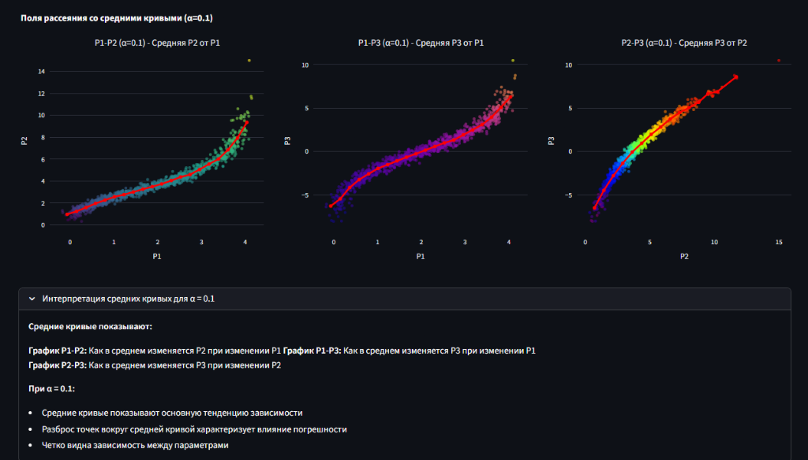

### Подробное объяснение раздела "Поля рассеяния со средними кривыми" (α=0.1)

---

#### Что здесь происходит?

В этом разделе визуализируются **поля рассеяния** для пар параметров надежности \(P_1, P_2, P_3\), дополненные **средними кривыми**, которые показывают усреднённые зависимости между параметрами.

---

#### Какие графики построены?

1. **График P1-P2 (средняя P2 от P1)**  
   Отображает, как в среднем меняется параметр \(P_2\) при изменении \(P_1\).

2. **График P1-P3 (средняя P3 от P1)**  
   Показывает среднюю зависимость параметра \(P_3\) от \(P_1\).

3. **График P2-P3 (средняя P3 от P2)**  
   Отражает, как в среднем изменяется \(P_3\) при изменении \(P_2\).

---

#### Как рассчитываются средние кривые?

- Данные разбиваются на **бинны** (интервалы) по оси X (например, по \(P_1\) для графика P1-P2).
- В каждом бине вычисляется **среднее значение** соответствующего параметра по оси Y (например, среднее \(P_2\) в каждом интервале \(P_1\)).
- Полученные средние значения соединяются линией — это и есть **средняя кривая**.

Функция `compute_mean_curve(x, y, num_bins=20)` реализует этот алгоритм.

---

#### Что показывают красные линии?

Красные линии — это **средние кривые**, которые отображают **математическое ожидание** зависимой переменной при фиксированном значении независимой.

---

#### Значение цветовой шкалы точек

Цвет точек отражает значение третьего параметра, не участвующего в текущем графике:

- На графике P1-P2 цвет точек — значение \(P_3\).
- На графике P1-P3 цвет точек — значение \(P_2\).
- На графике P2-P3 цвет точек — значение \(P_1\).

Это помогает визуально оценить взаимосвязи и распределения всех трех параметров одновременно.

---

#### Интерпретация для α = 0.1 (низкий уровень шума)

- **Средние кривые показывают основную тенденцию зависимости** между параметрами — как они связаны в среднем.
- **Разброс точек вокруг средней кривой отражает влияние погрешности (шума) измерений.**
- При малом α (0.1) **зависимость между параметрами четко видна**, шум минимален, и средняя кривая хорошо описывает общую тенденцию.

---

#### Практическая значимость

- Эти графики помогают понять **структуру и характер взаимосвязей** между параметрами надежности.
- Средние кривые дают простой способ визуализировать и интерпретировать сложные многомерные зависимости.
- Анализ разброса точек вокруг средней кривой позволяет оценить уровень шума и точность измерений.
- Это важно для последующего построения регрессионных моделей и принятия решений в инженерных и научных задачах, связанных с надежностью систем.

---

### Итог

- На основе исходных данных с добавленным шумом строятся поля рассеяния.
- Средние кривые вычисляются через бинирование и усреднение, показывая основную тенденцию.
- Визуализация помогает понять, как параметры \(P_1, P_2, P_3\) взаимосвязаны и как влияет уровень погрешности α.
- При α=0.1 зависимость между параметрами хорошо различима и описывается гладкими средними кривыми.