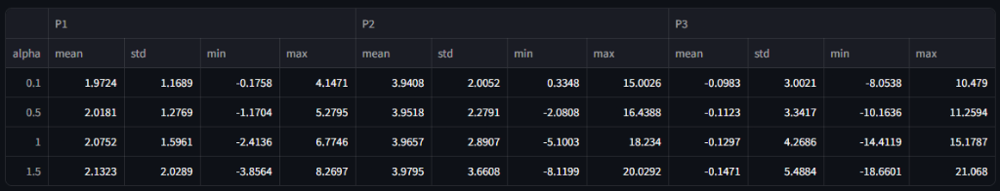

Таблица, представленная на рисунке, содержит статистические характеристики сгенерированных данных для трёх параметров надежности (P1, P2, P3) при разных уровнях погрешности измерений (обозначенной как alpha).

Вот объяснение каждого столбца и значения в таблице:

---

### Общая структура таблицы

- **alpha** — уровень погрешности измерений. Это параметр α, который масштабирует стандартное отклонение добавляемого шума к данным.
- Для каждого параметра P1, P2, P3 представлены следующие статистики:
  - **mean** — среднее значение (математическое ожидание) параметра по выборке.
  - **std** — стандартное отклонение параметра (измеряет разброс значений вокруг среднего).
  - **min** — минимальное значение параметра в выборке.
  - **max** — максимальное значение параметра в выборке.

---

### Пояснение по параметрам P1, P2, P3

- **P1** — параметр, сгенерированный из равномерного распределения на отрезке [0,4], к которому добавлен шум, пропорциональный α.
- **P2** — параметр, сгенерированный из распределения Эрланга (форма=4, масштаб=1), с добавлением шума.
- **P3** — параметр, сгенерированный из нормального распределения N(0,3), с добавлением шума.

---

### Значения в таблице

Например, для α=0.1:

- P1: среднее 1.9724, стандартное отклонение 1.1689, минимальное -0.1758, максимальное 4.1471
- P2: среднее 3.9408, стандартное отклонение 2.0052, минимальное 0.3348, максимальное 15.0026
- P3: среднее -0.0983, стандартное отклонение 3.0021, минимальное -8.0538, максимальное 10.479

---

### Что это значит?

- С увеличением α (погрешности) разброс (std) у параметров растет, что отражает увеличение шума в данных.
- Минимальные и максимальные значения показывают границы, в которых варьируются данные для каждого параметра.
- Средние значения дают представление о центральной тенденции параметров с учетом шума.

---

### Связь с кодом

В коде:

- Данные генерируются для каждого α с добавлением шума ε_i ~ N(0, α·σ_i).
- Таблица — это сводная статистика сгенерированных данных для каждого α.
- Она помогает понять, как уровень шума влияет на распределение параметров.